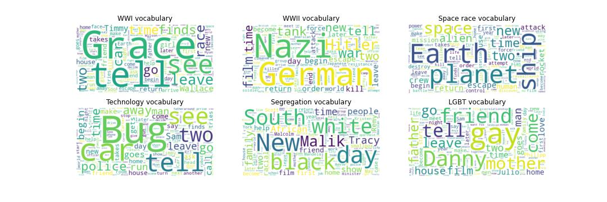

# Movies: today's time machine

#### Clara Scherrer, Noémie Chillier, Nathan Decurnex, Thibaut Hennel

## Abstract
At first, when asking 'what are movies made for?', the first answer that comes to mind is 'for entertainment!'. But movies are packed in diverse sources of information and are therefore rich objects of analysis. Often, only news articles or scientific publications are considered as reliable news sources and cinema seems to belong to fiction, they do not convey reality but its representation. In this project, we would like to focus on movies that portray History. Some try to represent historical events conscientiously and others just use them as a setting for their story plots. However, by bringing the biggest events of the past century to the screen, these movies fuel the heritage of the world's memory, so we never forget the events that shaped our existence. We therefore have an interest in the when and how movies have portrayed historical events. We will dive into the plot summaries to identify historical events and perform multi-step analysis to investigate the way these were handled over time by considering the genre of the movies, the plots and the actors that played in them. 

## Research questions
1. Can we relate a given movie to specific historical periods ?
2. To what extent can we extract historical information and evidence in movies ?
3. What is the relationship between movie genre and the event it portrayed ? 
4. Are there preferred actor ethnicitiy, age or gender distributions to cover an event?
5. Does the way of portraying a particular event change over time ?
6. Could movie plot sentiment analysis bring to light certain historical events ?
7. Are there relations and similarities between different historical events ?

## Additional datasets
Wikidata - we extracted actor ethnicities corresponding to the freebase IDs found in character.metadata.tsv.

## Methods
To identify historical events, we created lexical fields related to the events using our personal knowledge and already existing lists of words on the web. Each movie plot is then parsed through these dictionnaries, the number of words they have in common are counted as well as their occurance. To avoid false positives we have setted a threshold of number of common words which accepts a movie as portraying a particular event or not. We also have to find a way to remove the dependency of our method to the length of the dictionnary or the length of the plot summary. Moreover, if comparisons are performed between these engineered features, a sort of harmonization (standardization) needs to be made before any analysis. All these issues need to be addressed in order to limit the bias introduced into our hand-crafted features. 

We also would like to have a way to confirm that our method is performing a good extraction of historical events. Our preliminary analysis were based on word frequencies in movie plot summaries assigned to a historical period. These words should be linked to our historical event without even specifying them in our dictionnaries.

Once these specific features are built, we can perform simple anaylsis with other variables already present in the data set such as movie genre, box office revenue, gender proportions or ethinicities of actors playing in movies. This additional information would characterize how the historical event is portrayed through our screens. 

To go more into the depths of historical movies, engineered variables could be built to explore which sentiments or values are expressed in films. History encapsulates themes which expose the human condition, our feelings, weaknesses, triumphs, and tragedies. Therefore, the sentiment analysis of movie plots could expose major historical events, which is what we could explore in the future. 

The last research focus would be to identify similarities between historical periods. Tools like clustering methods could help us group historical events between them.

## Timeline
- 18.11.22 : Milestone P2, initial analysis and data handling/exploration pipeline.  
- 25.11.22 : Creation and testing of dictionaries of historical events of interest.  
- 02.12.22 : Homework 2.  
- 09.12.22 : Final plots, datastory planned on paper.  
- 18.12.22 : Datastory elaboration using plots, start design of the website and verify the notebook.  
- 23.12.22 : Milestone P3, full datastory and notebook submitting.  

## Milestones
1. Milestone P2, initial analysis and data handling pipeline.  
2. Define the historical periods/events of interest
3. Create the corresponding dictionnaries and test their specificity
4. Assess the quality of the dictionnaries
4. Create main datastory graphs
5. Try out sentiment analysis to identify and characterise historical events
6. Cross analysis between historical events
7. Create website for the datastory
8. Milestone P3, full datastory and notebook submitting

## Questions for TA's

Suggestion on how to improve our method based on plot summaries to assign a movie to a historical period ?  
What is the most relevant way to define our number of word threshold ?  
Would you suggest focusing our analysis on one specific historical period ?  

